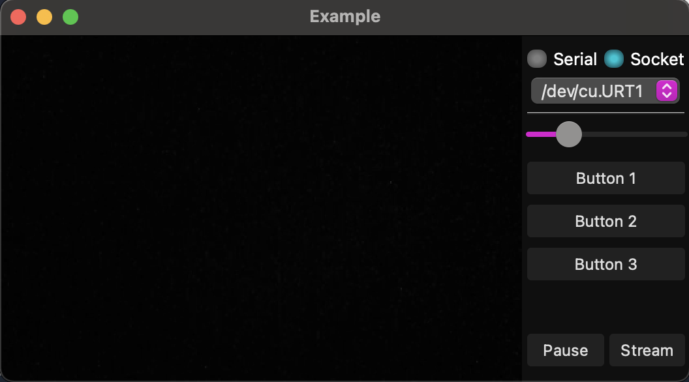

# REMIO MOCKUP TEMPLATE
This is an python remio mockup template, estructured to be used as experiment of a remote lab.

## GUI
This project was made with PyQt5:


## Communications Schema
The present project uses socketio for remote control.


## Structure
```
.
├── arduino
│   └── mockup
│       └── mockup.ino
├── docs
├── public
├── server
├── utils
├── gui.py
├── gui.ui
├── production.py
├── README.md
├── requirements.txt
└── settings.py
```

## Installation
First you probabily want to create and activate a virtual env
```bash
python3 -m venv venv

source venv/bin/activate
```

## Dependencies
After you set the virutal env, you should install dependencies as follows:
```
pip install -r requirements.txt
```

## Run Mockup GUI
This experiment uses PyQt5 framework to provide a GUI.
```
python gui.py
```

## Run Mockup without GUI (Production)
This experiment also, could be controlled remotly, then you probably not want to use the local gui.

```
python production.py
```
## SocketIO Server
A socketio server was added for do some tests.
```
python run_server.py
```
