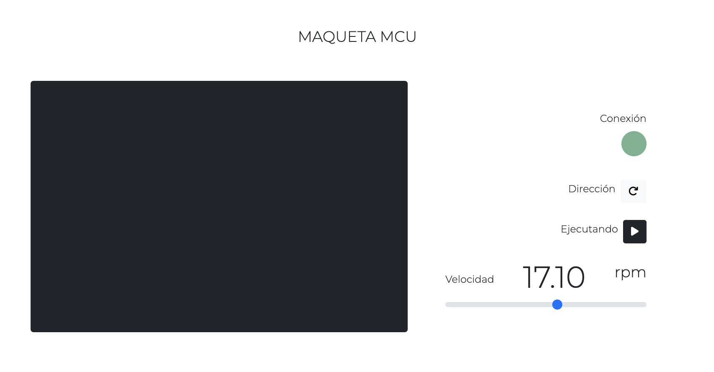
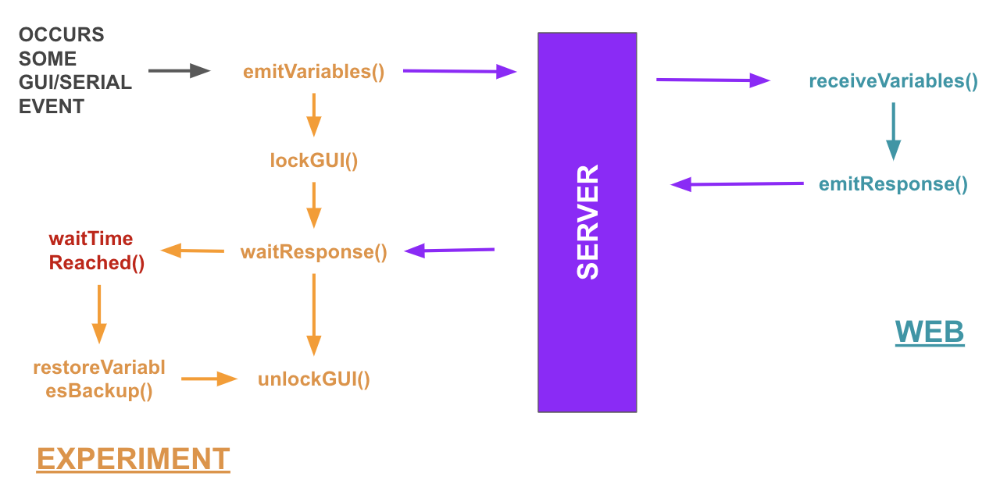

### 🌏🧪 Remio Mockup Template
This is a python template for making experiment with `remio` library. It gives to you a project structure, a some utils for developing quickly remote laboratory projects.

### 🎨 GUI
The project includes a simple GUI made with Bootstrap 5. You can find the files on `public` folder:


You could edit it according to your needs. I recommed to you use `QtDesigner` program which simplifies the GUI creation proccess. 

### 💬 Communications Schema
The project uses a simple mechanism to establish bidirectional communications in real time, using the `socketio` protocol/library.


### 🗂️ Structure
Some folders were created to help you structure the project:
```
.
├── arduino
│   └── mockup
│       └── mockup.ino
├── docs
├── public
├── server
├── utils
├── gui.py
├── gui.ui
├── production.py
├── README.md
├── requirements.txt
└── settings.py
```

### ⚙️ Installation
Clone the repository:
```
git clone https://github.com/jsonfm/remio-mockup-template.git [your-project-name]
```

Create and activate a virtual environment:
```bash
python3 -m venv venv

source venv/bin/activate
```

### ⚒️ Dependencies
After you set the virutal env, install dependencies:
```
pip install -r requirements.txt
```

### ⚡️ Development
This experiment uses PyQt5 framework to provide a GUI.
```
python gui.py
```

### 🚀 Production
To run the experiment without the local GUI (production), you could use the `product.py` file:

```
python production.py
```
### ✨ SocketIO Server
A socketio server was added for do some tests.
```
python run_server.py
```
